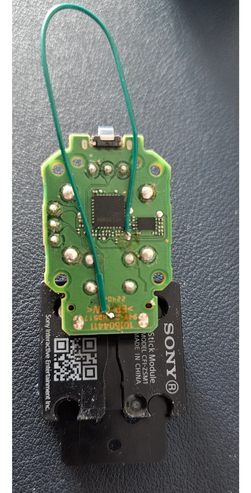

# Dualsense_Edge_Modules_Callibration
# Proof of concept script for calibrating Dualsense Edge Modules

# Introduction
I’m excited to share that I’ve successfully figured out how to calibrate the DualSense Edge modules. This project took me a couple of months of research, experimentation, and a few sacrificial controllers and modules along the way. Hopefully, this information can help others and give new life to drifting or malfunctioning Edge modules.

# This script will center the stick module center point
you can edit it to just save the calibration if you want by commenting out 
calibration and just use save part

# Video Proof
I have a short video demonstration showing the calibration in action:

The calibration can be done using the DualSense Edge controller itself. However, it’s not purely software-based because you must wire a single small cable inside the Edge module:

Soldering Required: You need to apply 1.8V to the top test point in the module by soldering one small cable.

Photo: Here is an example of the single cable you need to solder:

Make sure you have hidapi installed with
pip install hidapi

Than just run the script:
python callibrate_edge_modules.py

# Software Part
No special unlocking (like NVS unlocking) is needed. You can calibrate the DualSense Edge the usual way using any of the following methods:

DriftGuard (Steam): DriftGuard Gamepad Maintenance Tool (Steam)
https://store.steampowered.com/app/3174550/DriftGuard_Gamepad_Maintenance_Tool/

DriftGuard (Android): DriftGuard on Google Play
https://play.google.com/store/apps/details?id=com.vestracode.driftguard&hl=pl

DualShock-Tools: Calibration website (Edge support will be added later if the creator will do it)
https://dualshock-tools.github.io/

# Saving the Calibration
After running the calibration process, you need to send a HID feature report to save the calibration:
128, 21, 1, 1

21 corresponds to the Edge modules test device ID.

You can read the calibration from the modules using:
128, 21, 18, 0  // Left module
128, 21, 18, 1  // Right module

Once you send the 128, 21, 1, 1 command, the controller will no longer respond to additional HID reports sent to 128. To test whether the calibration was successful, simply disconnect and reconnect your controller.

# Credits & Donations
I’m sharing this for the benefit of the community. If you find it helpful, please credit my work. If you’d like to support future developments (or just buy me a coffee), you can donate here:

https://www.paypal.com/donate/?business=CV5LLN6DKMGYC&no_recurring=0&currency_code=USD

