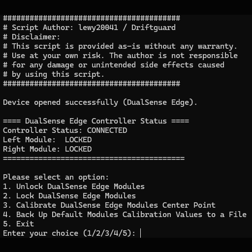
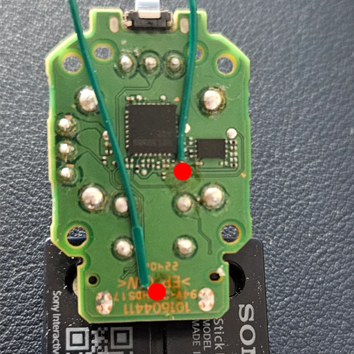
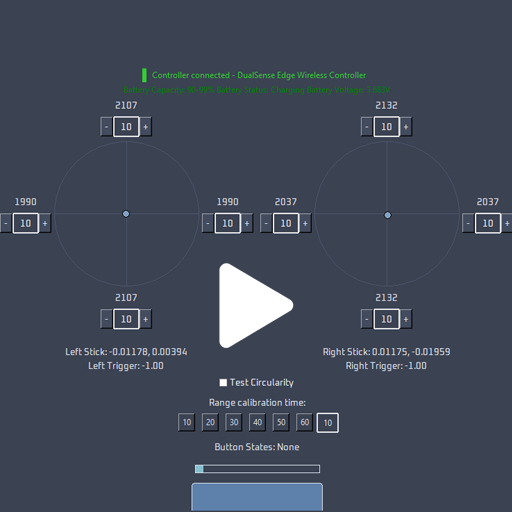
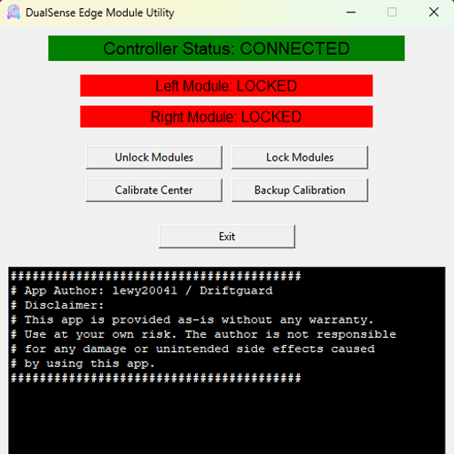

# Introduction
This is Proof of concept script for unlocking Dualsense Edge Modules.

This script is provided as-is without any warranty.
Use at your own risk. The author is not responsible
for any damage or unintended side effects caused
by using this script.

I’m excited to share that I’ve successfully figured out how to unlock and calibrate the DualSense Edge Modules. This project took me a couple of months of research, experimentation, and a few sacrificial controllers and modules along the way. Hopefully, this information can help others and give new life to drifting or malfunctioning Edge modules.

# What it can do:

# Photo: Here is an example of the single cable you need to solder:

The calibration can be done using the DualSense Edge controller itself. However, it’s not purely software-based because you must wire a single small cable inside the Edge module:
Soldering Required: You need to apply 1.8V to the top test point in the module by soldering one small cable.

# Video Proof
I have a short video demonstration showing the calibration in action:

# How to run the script (Windows):
1. Solder the wire like in the photo
2. Download and install python
3. Create a folder on disk C like Edge_Module_Utility
4. Extract the downloaded code to C:\Edge_Module_Utility
5. Open terminal and write "cd C:\Edge_Module_Utility"
3. Create new python virtual enviorment in your current location:
python -m venv venv

4. Activate virtual enviorment:
.\venv\Scripts\activate

5. Install requirements:
pip install -r requirements.txt

6. Connect the controller to pc using USB cable

6. Run the script:
python EdgeModuleUtility.py

# Precompiled app
As i saw that some people have troubles using the script i also compiled a simple app.
Just download DualSense_Edge_Module_Utility_Precomiled_Exe.zip
Unzip the archive and run the app.

# Software Part
No special unlocking (like NVS unlocking) is needed. You can calibrate center and range of the DualSense Edge modules the usual way using any of the following methods:

DriftGuard (Steam): DriftGuard Gamepad Maintenance Tool
https://store.steampowered.com/app/3174550/DriftGuard_Gamepad_Maintenance_Tool/

DriftGuard (Android): DriftGuard on Google Play
https://play.google.com/store/apps/details?id=com.vestracode.driftguard&hl=pl

DualShock-Tools: Calibration website (Edge support will be added later if the creator will do it)
https://dualshock-tools.github.io/

# Saving the Calibration
After unlocking the modules, every change in calibration is saved without
using any aditional commands.
You can unlock modules one by one or both at a time. Only modules with wire will be unlocked.
For safty reasons after you done with calibration lock the modules and remove the wire.

# Credits & Donations
I’m sharing this for the benefit of the community. If you find it helpful, please credit my work. If you’d like to support future developments (or just buy me a coffee), you can buy one of my apps or donate here:

https://www.paypal.com/donate/?business=CV5LLN6DKMGYC&no_recurring=0&currency_code=USD

